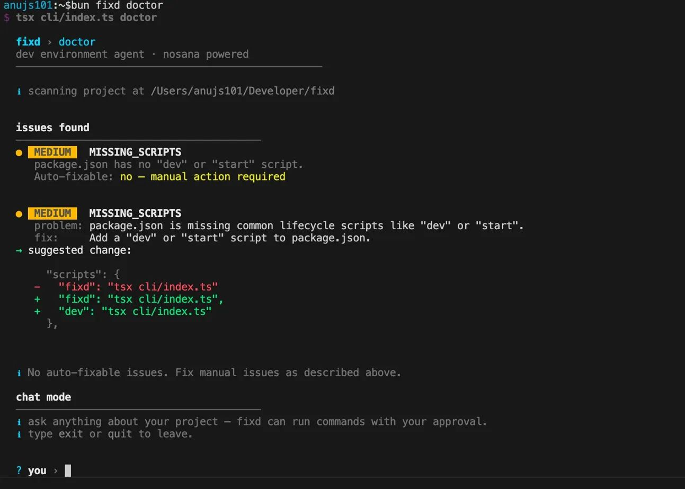

<div align="center">

#  fixd

### Your AI-powered dev environment agent — diagnose, scaffold, and ship faster.

[](https://github.com/anujs101/fixd)
[](LICENSE)
[](https://console.groq.com)
[](https://typescriptlang.org)
[](https://bun.sh)

</div>

---

##  Demo

<div align="center">
  
</div>

```
$ fixd doctor

  ✖ [TYPESCRIPT] src/index.ts:12:5  TS2345  Argument of type 'string' is not assignable...
  ✖ [TYPESCRIPT] src/lib/auth.ts:44:3  TS2304  Cannot find name 'db'...

  ─── issues found ──────────────────────────────────────────────────────
  ● [HIGH]  MISSING_ENV_VAR
     problem: DATABASE_URL is not set in .env
     fix:     Add DATABASE_URL to .env and restart the dev server

  ✔ apply 1 auto-fix? › yes

  ─── verification ──────────────────────────────────────────────────────
  ✔ 1 issue resolved
  ✔ project is clean

  ─── chat mode ─────────────────────────────────────────────────────────
  › you:
```

---

##  Problem Statement

Every developer has wasted hours on the same class of problems: a missing env var that crashes the server at 2am, a `tsconfig` that's silently misconfigured, a scaffold that's already outdated before the first commit, or a deployment that requires knowing five different CLI tools.

These aren't hard problems. They're just **tedious, repetitive, and context-dependent** — which makes them perfect for an AI agent.

**fixd** brings a language-model-powered agent directly into your terminal to handle exactly this. No dashboard. No SaaS. No agent server to babysit. Just run `fixd` in your project and get a senior dev looking over your shoulder.

---

##  Solution Overview

`fixd` is a zero-infrastructure CLI agent that:

1. **Scans your project** deterministically — reads `package.json`, `tsconfig.json`, `.env`, Prisma schema, running ports, and more.
2. **Runs stack-aware diagnostics** — executes `tsc`, `eslint`, `cargo check`, `go vet`, `mypy`, and other linters in parallel without any configuration from you.
3. **Sends rich context to an LLM** (via Groq) to reason about root causes and suggest diffs.
4. **Auto-applies safe fixes** with your approval, then **re-scans to verify** the fixes actually worked.
5. **Drops into an agentic chat loop** where it can propose and run shell commands or write files — all gated by your explicit approval.
6. **Remembers everything** across sessions via a local `.fixd/memory.json`, so it knows what was broken before and what was already fixed.

---

##  Features

###  `fixd doctor` — Intelligent Diagnostics
- **Multi-stack static analysis** — auto-detects TypeScript, Python, Rust, Go, Ruby, PHP, Java, and Kotlin projects; runs the right tool for each.
- **Structured issue reporting** — severity-tagged (`HIGH / MEDIUM / LOW`), auto-fixable vs. manual triage, with suggested diffs.
- **Post-fix verification** — re-scans after applying patches to confirm issues are actually resolved, not just suppressed.
- **Agentic chat** — interactive REPL where the agent can propose and run commands (with your approval) in a self-correcting loop.

### `fixd init` — AI Scaffolding with Live Docs
- **Guided stack selection** — choose your framework (Hono / Express / Fastify), database (PostgreSQL / MySQL / SQLite / MongoDB), ORM (Prisma / Drizzle), auth (better-auth / Clerk), and frontend (Next.js / Vite-React).
- **Context7 doc injection** — fetches real-time, version-accurate library documentation before generation, eliminating stale API hallucinations.
- **Full project output** — generates `package.json`, `tsconfig.json`, `.env`, `.gitignore`, `README.md`, entry points, Prisma schema, and auth config in one shot.
- **Auto-wired setup** — runs `git init` + initial commit + dependency install automatically after writing files.

###  `fixd deploy` — Containerize & Ship
- **AI-generated Dockerfile** — analyses your `package.json` and `tsconfig` to produce a production-ready multi-stage build.

###  Persistent Memory
- Stores project history in `.fixd/memory.json` — last scan timestamp, known stack, previously fixed issues, and per-session chat summaries.
- Injected into every LLM prompt so the agent has full context without you having to re-explain your project.
- Capped at 50 fix records and 10 session summaries to stay prompt-efficient.

###  Resilient LLM Layer
- **Smart model routing** — lightweight tasks (`classify`, `explain`) use `llama-4-scout`; heavy tasks (`generate`, `diagnose`) use `qwen3-32b`.
- **Automatic fallback** — if the large model is rate-limited or unavailable, transparently retries with the small model.
- **Retry logic** — handles `429 Rate Limited` and `5xx` errors with exponential back-off, up to 3 attempts.

---

##  Tech Stack

| Layer | Technology |
|---|---|
| **Runtime** | Node.js 23 / Bun |
| **Language** | TypeScript 6 (ESM) |
| **LLM Backend** | [Groq API](https://console.groq.com) (OpenAI-compatible) |
| **Small Model** | `meta-llama/llama-4-scout-17b-16e-instruct` |
| **Large Model** | `qwen/qwen3-32b` |
| **Live Docs** | [Context7](https://context7.com) API |
| **CLI UX** | `chalk`, `ora`, `inquirer`, `readline-sync` |
| **Process Execution** | `execa` |
| **File Watching** | `chokidar` |
| **Containerization** | Docker (Node 23-slim base) |
| **Diagnostics** | `tsc`, `eslint`, `mypy`, `flake8`, `cargo check`, `go vet`, `rubocop`, `phpstan` |

---

##  Architecture

```
┌─────────────────────────────────────────────────────┐
│                     fixd CLI                        │
│                  cli/index.ts                       │
│   (entry point · preflight · command routing)       │
└────────────┬───────────────────────┬────────────────┘
             │                       │
    ┌────────▼──────┐       ┌────────▼──────┐
    │  fixd doctor  │       │   fixd init   │
    │  cli/doctor.ts│       │  cli/init.ts  │
    └────────┬──────┘       └────────┬──────┘
             │                       │
    ┌────────▼──────────────────────▼────────────────┐
    │                  cli/lib/                       │
    │                                                 │
    │  llm.ts        ← Groq API client                │
    │  agent.ts      ← multi-turn conversation state  │
    │  diagnostics.ts← stack detection + linting      │
    │  memory.ts     ← .fixd/memory.json persistence  │
    │  context7.ts   ← live library doc fetcher       │
    │  patcher.ts    ← file diff proposal + apply     │
    │  executor.ts   ← shell command extraction + run │
    │  display.ts    ← terminal UI primitives         │
    └─────────────────────────┬──────────────────────┘
                              │
    ┌─────────────────────────▼──────────────────────┐
    │               src/actions/                      │
    │  scanFiles.ts  ← project scanner (env, pkg, ts) │
    │  fixEnv.ts     ← deterministic issue detector   │
    └────────────────────────────────────────────────┘
```

### Key Data Flows

**`fixd doctor` flow:**
```
cwd → scanProject() → runDiagnostics() → detectIssues()
    → [LLM] structured diagnosis prompt
    → renderDiagnosisResponse() → user approval
    → apply fixes → re-scan → verify
    → agenticTurn() chat loop (infinite, with context7 enrichment)
```

**`fixd init` flow:**
```
user prompts → fetchDocsForStack() [Context7 API]
            → scaffold prompt + live docs → askStream() [Groq]
            → proposeAndApply() → git init → install deps
```

---

##  Getting Started

### Prerequisites

- **Node.js** ≥ 18 or **Bun** ≥ 1.0
- A **Groq API key** — free tier at [console.groq.com/keys](https://console.groq.com/keys)
- _(Optional)_ A **Context7 API key** for live library docs — [context7.com](https://context7.com)

### Installation

```bash
# Clone the repository
git clone https://github.com/anujs101/fixd.git
cd fixd

# Install dependencies
npm install
# or
bun install
```

### Environment Setup

```bash
cp .env.example .env
```

Open `.env` and fill in your keys:

```env
# Required
GROQ_API_KEY=gsk_xxxxxxxxxxxxxxxxxxxx

# Optional — enables live library documentation in init + chat
CONTEXT7_API_KEY=your_context7_key

# Optional model overrides
# SMALL_MODEL=meta-llama/llama-4-scout-17b-16e-instruct
# LARGE_MODEL=qwen/qwen3-32b
```

### Running Locally

```bash
# Verify API connectivity
npm run fixd status

# Run from any project directory
npm run fixd doctor
npm run fixd init
npm run fixd deploy
```

Or, if you want to use it globally across your machine:

```bash
npm link        # or: bun link
fixd status     # now available system-wide
```

---

##  Usage

### Diagnose a broken project

```bash
cd /path/to/your/project
fixd doctor
```

fixd will:
1. Scan all config files and detect your stack
2. Run the relevant type checkers and linters in parallel
3. Show a structured issue report — severity, root cause, suggested fix
4. Ask if you want to apply auto-fixable issues
5. Verify the fixes, then drop into an interactive chat

**In chat mode:**

```
› you: why is my prisma connection failing on Neon?

  fixd: Your DATABASE_URL is using the direct connection string — Neon requires
        the pooled URL for serverless environments. Add a separate DIRECT_URL for
        migrations.

  ─── agent wants to run ────────────────────────────────────────
  $ npx prisma db push

  run this command? › yes
```

---

### Scaffold a new project

```bash
mkdir my-api && cd my-api
fixd init
```

```
  project name       my-api
  backend framework  hono
  database           postgres
  postgres hosting   neon
  orm                prisma
  auth               better-auth
  frontend           none
  package manager    bun

  scaffold this project? › yes

  fetching latest docs...  ✔ fetched docs for: hono, prisma, better-auth
  generating... (7 files so far)
  ✔ created: package.json
  ✔ created: tsconfig.json
  ✔ created: src/index.ts
  ✔ created: prisma/schema.prisma
  ✔ created: src/lib/auth.ts
  ✔ created: .env
  ✔ created: .gitignore
  ✔ git repository initialised with initial commit
  ✔ dependencies installed
```

---

### Check API + model status

```bash
fixd status
```

```
  ✔ Groq API reachable
  small model : meta-llama/llama-4-scout-17b-16e-instruct
  large model : qwen/qwen3-32b
  project     : /Users/you/my-project
```

---

##  Folder Structure

```
fixd/
├── cli/                        # CLI entry points and command implementations
│   ├── index.ts                # Main entry — argument parsing, preflight, routing
│   ├── doctor.ts               # Diagnose, fix, verify, and chat loop
│   ├── init.ts                 # Guided project scaffolding
│   ├── deploy.ts               # Dockerfile generation + Nosana deploy
│   └── lib/
│       ├── llm.ts              # Groq API client — ask(), askStream(), chat()
│       ├── agent.ts            # Multi-turn conversation state management
│       ├── diagnostics.ts      # Stack detection + parallel linter runner
│       ├── memory.ts           # .fixd/memory.json read/write/summarize
│       ├── context7.ts         # Context7 live doc fetching + prompt injection
│       ├── patcher.ts          # <<WRITE:>> file diff proposal + apply
│       ├── executor.ts         # Shell command extraction + execution
│       └── display.ts          # Terminal UI: spinners, colours, prompts
│
├── src/
│   └── actions/
│       ├── scanFiles.ts        # Project scanner (env vars, package.json, tsconfig, prisma, ports)
│       └── fixEnv.ts           # Deterministic issue detector + auto-fix rules
│
├── .fixd/                      # Auto-created per project — gitignored
│   └── memory.json             # Persistent project memory (history, fixes, stack)
│
├── .env.example                # Environment variable template
├── Dockerfile                  # Container build for Nosana deployment
├── tsconfig.json               # TypeScript compiler config
└── package.json                # Scripts and dependencies
```

---

##  Internal APIs

fixd is a CLI tool and has no public HTTP API. The following describes the internal module contracts.

### `cli/lib/llm.ts`

| Function | Description |
|---|---|
| `ask(prompt, task)` | Single-turn completion. Returns `string`. Routes to small or large model by task. |
| `askStream(prompt, task)` | Streaming generator. Yields text chunks as they arrive. Used by `init`. |
| `chat(messages, task)` | Multi-turn completion. Accepts a full `Message[]` history. |

**Task routing:**

| Task | Model |
|---|---|
| `classify`, `explain` | `llama-4-scout` (small, fast) |
| `generate`, `diagnose` | `qwen3-32b` (large, accurate) |
| `chat` | Auto-upgrades to large if the message looks like code generation |

---

### `cli/lib/diagnostics.ts`

| Function | Description |
|---|---|
| `runDiagnostics(projectPath)` | Auto-detects stack and runs all applicable checkers in parallel. Returns `CheckerResult[]`. |
| `formatDiagnosticsForContext(results)` | Formats results as structured text for LLM prompt injection. |
| `getAllErrors(results)` | Flattens all `ParsedError` objects across stacks into a single array. |

**Supported stacks and tools:**

| Stack | Tool |
|---|---|
| TypeScript | `tsc --noEmit` |
| JavaScript | `eslint` (compact format) |
| Python | `mypy`, `flake8` |
| Rust | `cargo check` |
| Go | `go vet` |
| Ruby | `rubocop` |
| PHP | `php -l`, `phpstan` |
| Java | `mvn compile` |
| Kotlin/Java | `gradle check` |

---

### `cli/lib/memory.ts`

| Function | Description |
|---|---|
| `loadMemory(projectRoot)` | Reads `.fixd/memory.json`. Returns empty memory if missing. |
| `saveMemory(memory)` | Atomically writes memory via temp file + rename. Never throws. |
| `updateFromScan(memory, scan)` | Updates `knownStack` and `lastScanned` from a fresh scan. |
| `recordFix(memory, fixes)` | Appends applied fixes to `fixedIssues` (capped at 50). |
| `summarizeSession(memory, log)` | Asks LLM for a 2-sentence summary and appends to `chatSummaries`. |
| `formatMemoryForPrompt(memory)` | Serializes memory as a prompt prefix for LLM context injection. |

---

### `cli/lib/context7.ts`

| Function | Description |
|---|---|
| `resolveLibraryId(name)` | Maps a library name to a Context7 ID. Falls back to search API. |
| `fetchDocs(libraryId, topic, maxTokens)` | Fetches documentation for a specific library and topic. |
| `fetchDocsForStack(stack)` | Fetches docs for an entire chosen stack, capped at 12,000 tokens. |
| `fetchDocsForQuery(query, projectLibraries)` | Fetches docs for libraries mentioned in a chat query. |
| `formatDocsForPrompt(docs)` | Formats fetched docs as a prompt prefix for LLM injection. |

---

##  Contributing

Pull requests are welcome. For significant changes, please open an issue first to discuss the direction.

1. Fork the repository
2. Create a feature branch: `git checkout -b feat/your-feature`
3. Commit your changes: `git commit -m "feat: add your feature"`
4. Push and open a PR

---

##  License

MIT © [Anuj Singh](https://github.com/anujs101)

---

<div align="center">

Built with frustration by developers who are tired of debugging their debuggers.

</div>
