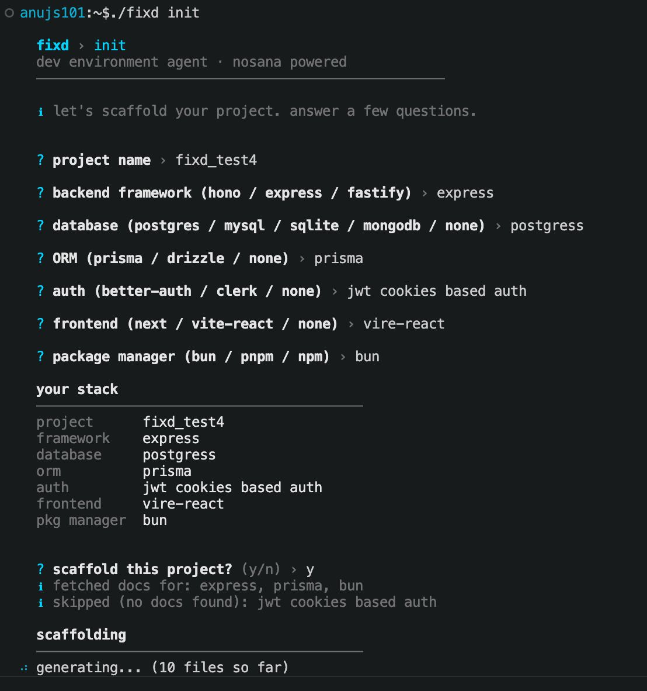

<div align="center">

#  fixd

### Your AI-powered dev environment agent — diagnose, scaffold, and ship faster.

[](https://github.com/anujs101/fixd)
[](LICENSE)
[](https://console.groq.com)
[](https://typescriptlang.org)
[](https://bun.sh)

</div>

---

##  Demo

<div align="center">
  
</div>

```
$ fixd doctor

  ─── explore ────────────────────────────
  explorer: hono + prisma + neon detected

  ─── Diagnosis Summary ───────────────────
  │ HIGH: DATABASE_URL missing from .env — Neon requires pooled + direct URLs
  │ MEDIUM: tsconfig strict mode not enabled

  ✔ apply 2 auto-fixes? › yes

  ─── verification ────────────────────────
  [Fix Outcome: FIXED — 2 issues resolved]
  ✔ project is clean

  ─── chat mode ───────────────────────────
  › you:
```

---

##  What is fixd?

Every developer has wasted hours on the same class of problems: a missing env var that crashes the server at 2am, a `tsconfig` silently misconfigured, a scaffold already outdated before the first commit, or a deployment that requires knowing five different CLI tools.

These aren't hard problems — they're **tedious, repetitive, and context-dependent.** Which makes them perfect for an AI agent.

**fixd** brings a multi-model agentic system directly into your terminal. No dashboard. No SaaS. No agent server. Just run `fixd` in your project and get a senior developer looking over your shoulder.

---

##  Commands

| Command | Description |
|---|---|
| `fixd doctor` | Full diagnostic: scan → detect → explore → diagnose → synthesize → fix → verify → chat |
| `fixd doctor --fast` | Single-agent mode — faster, skips parallel sub-agents |
| `fixd doctor --plan` | Show diagnosis and proposed fix plan before applying any changes |
| `fixd plan` | Alias for `fixd doctor --plan --fast` |
| `fixd init` | Scaffold a new project from scratch with live docs |
| `fixd init --yes` | Scaffold with defaults (Hono + Neon + Prisma + Bun) |
| `fixd deploy` | Generate Dockerfile + Nosana job definition |
| `fixd undo` | Restore all files from the last patch session |
| `fixd status` | Check API connectivity and active models |

---

##  Core Features

### `fixd doctor` — Intelligent Diagnostics

**5-phase pipeline:**

1. **Local scan** — reads `package.json`, `tsconfig.json`, `.env`, Prisma schema, running ports, node/bun versions
2. **Stack diagnostics** — runs `tsc`, `eslint`, `mypy`, `cargo check`, `go vet` and more in parallel, no config needed
3. **Parallel sub-agents** — `exploreProject()` (small model) + `diagnoseWithAgent()` (large model) analyse issues concurrently
4. **Synthesis** — a third sub-agent deduplicates and escalates severity across both analyses into a unified summary
5. **Agentic chat** — interactive loop with file-writing, command execution, and memory across turns

**Smarter fix loop:**
- **Fix-outcome tracking** — after every patch, fixd re-scans and computes `FIXED / NO CHANGE / REGRESSION`. The agent sees the outcome and routes accordingly.
- **Hypothesis tracking** — every fix attempt is recorded as a hypothesis (`claim → file → outcome`). Repeated identical patches are blocked automatically.
- **Outcome-based routing** — `NO CHANGE` escalates with the full hypothesis log; `REGRESSION` warns the agent to reassess completely; `FIXED` continues with the updated issue list.
- **Depth pressure** — at depth 4, the agent is warned it has 2 attempts left. At depth 6, a `STUCK REPORT` is generated showing everything that was tried.
- **Per-error format instructions** — Prisma issues force `WRITE .env` patches only; port conflicts force a bash kill command; TS errors force `EDIT` patch markers. Eliminates prose.

### `fixd plan` — Safe Preview Mode

```bash
fixd plan         # or: fixd doctor --plan
```

Runs the full diagnostic pipeline, displays the synthesis summary, and asks for your approval before entering the chat loop. Zero changes are made unless you say yes.

### `fixd init` — AI Scaffolding with Live Docs

- **Guided interview** — framework, database, ORM, auth, frontend, package manager — with typo normalization
- **Plan sub-agent** — generates a file manifest, required env vars, gotchas, and post-install steps before writing a single file
- **Context7 doc injection** — fetches live, version-accurate library docs before generation, eliminating stale API hallucinations
- **Completeness guard** — ensures auth files, Prisma schema, and frontend entry points are never omitted
- **FIXD.md generation** — writes a `FIXD.md` into your project for future `fixd doctor` sessions to read for instant stack context
- **Automated setup** — runs `git init` + commit + `bun/npm install` + `prisma generate` automatically

### `fixd deploy` — Containerize & Ship

Generates a production-ready `Dockerfile` and Nosana job definition from your project structure.

### `fixd undo` — Atomic Rollback

Every patch is backed up in `.fixd/backups/<timestamp>/` before writing. `fixd undo` restores all files from the last session atomically.

---

##  Persistent Memory

fixd remembers across sessions via `.fixd/memory.json` (auto-gitignored):

| Field | Description |
|---|---|
| `fixedIssues` | Last 50 issues that were fixed, with timestamps |
| `chatSummaries` | Last 10 LLM-generated session summaries (2 sentences each) |
| `causalChain` | Last 30 causal entries — file changed, issue type, action taken, outcome, follow-up issues |
| `stackPatterns` | Up to 50 fix patterns keyed by stack+issueType, with confidence scores that grow across projects |

**Causal history** is injected into every LLM prompt:
```
[2026-05-17] prisma/schema.prisma | PRISMA_POOLED_WITHOUT_DIRECT_URL → added directUrl → resolved
[2026-05-16] .env | MISSING_DATABASE_URL → added placeholder → no_change → followup: PRISMA_POOLED
```

**Stack patterns** let fixd get smarter across projects — a fix that worked 3 times on `hono+prisma+postgresql` gets a confidence boost and is suggested first next time.

---

##  LLM Architecture

fixd uses **three model tiers** routed by task:

| Task | Model | Provider |
|---|---|---|
| `classify`, `explain` | `llama-4-scout-17b` | Groq (fast) |
| `generate`, `diagnose` | `gpt-o1-120b` | OpenRouter (primary) |
| Large model fallback | Clarifai API | Clarifai |
| Last resort | Small model | Groq |

**New in 0.3.0:**

- **Relevance-gated Context7** — before fetching library docs, a small-model classifier decides which (if any) project libraries are relevant to the current query. Irrelevant queries pay zero doc tokens.
- **Iterative exploration** — `exploreProject()` has a two-pass confidence check. If the small model returns `unknown` on framework/runtime/packageManager, it fires a second large-model pass to correct and complete the result.
- **File relevance scoring** — `readRelevantFiles()` passes candidate files through a small-model filter before reading them. Focused bug-fix queries only load the relevant files.

---

##  Architecture

```
┌─────────────────────────────────────────────────────┐
│                     fixd CLI                        │
│                  cli/index.ts                       │
│   (entry point · preflight · command routing)       │
└────────────┬───────────────────────┬────────────────┘
             │                       │
    ┌────────▼──────┐       ┌────────▼──────┐
    │  fixd doctor  │       │   fixd init   │
    │  cli/doctor.ts│       │  cli/init.ts  │
    └────────┬──────┘       └────────┬──────┘
             │                       │
    ┌────────▼──────────────────────▼────────────────┐
    │                  cli/lib/                       │
    │                                                 │
    │  llm.ts          ← multi-service LLM routing    │
    │  agent.ts        ← session state + system prompt│
    │  sub-agents.ts   ← explore / diagnose / synth   │
    │  diagnostics.ts  ← stack detection + linting    │
    │  memory.ts       ← causal chain + stack patterns│
    │  context7.ts     ← relevance-gated doc fetcher  │
    │  patcher.ts      ← atomic file patch + backup   │
    │  executor.ts     ← shell command extraction      │
    │  projectReader.ts← scored file relevance reader │
    │  command-classifier.ts ← 3-stage safety check   │
    │  display.ts      ← terminal UI primitives        │
    └─────────────────────────┬──────────────────────┘
                              │
    ┌─────────────────────────▼──────────────────────┐
    │               src/actions/                      │
    │  scanFiles.ts  ← project scanner                │
    │  fixEnv.ts     ← deterministic issue detector   │
    └────────────────────────────────────────────────┘
```

### `fixd doctor` data flow

```
cwd
 → scanProject()              # reads pkg.json, tsconfig, .env, prisma, ports
 → runDiagnostics()           # tsc / eslint / mypy / cargo / go vet (parallel)
 → detectIssues()             # structured DetectedIssue[] list
 → exploreProject()           # small model → ExploreResult JSON (2-pass if low confidence)
 → diagnoseWithAgent()        # large model → structured SEVERITY/TYPE/PROBLEM/FIX blocks
 → synthesizeDiagnosis()      # small model → unified summary (dedup + severity escalation)
 → [--plan: confirm before continuing]
 → auto-fix phase             # apply auto-fixable issues with verification
 → agenticTurn() chat loop
     │
     ├── scoreFileRelevance()    # filter which files to read this turn
     ├── scoreDocRelevance()     # filter which libraries need docs
     ├── sendMessage()           # LLM turn
     ├── proposeAndApply()       # parse + apply patches
     ├── computeFixOutcome()     # before/after scan → FIXED/NO CHANGE/REGRESSION
     ├── recordStackPattern()    # update confidence in memory
     └── recurse with outcome-routed message
```

---

##  Getting Started

### Prerequisites

- **Node.js** ≥ 18 or **Bun** ≥ 1.0
- A **Groq API key** — free tier at [console.groq.com/keys](https://console.groq.com/keys)
- _(Recommended)_ An **OpenRouter API key** for large model calls — [openrouter.ai](https://openrouter.ai)
- _(Optional)_ A **Context7 API key** for live library docs — [context7.com](https://context7.com)

### Installation

```bash
git clone https://github.com/anujs101/fixd.git
cd fixd
npm install   # or: bun install
```

### Environment Setup

The recommended location is `~/.config/fixd/.env` — this keeps your keys out of any project repository:

```bash
mkdir -p ~/.config/fixd
cat > ~/.config/fixd/.env << 'EOF'
# Required
GROQ_API_KEY=gsk_xxxxxxxxxxxxxxxxxxxx

# Recommended — large model calls (diagnose, generate)
OPENROUTER_API_KEY=sk-or-xxxxxxxxxxxxxxxxxxxx

# Optional — live library docs in init + chat
CONTEXT7_API_KEY=your_context7_key

# Optional tuning
# FIXD_AUTO_RUN_LEVEL=moderate   # conservative | moderate | aggressive
# FIXD_COMMAND_TIMEOUT=120000    # ms
EOF
```

### Running Locally

```bash
# Verify connectivity
npm run fixd -- status

# Diagnose your project
cd /path/to/your/project
npm run fixd -- doctor

# Scaffold a new project
mkdir my-api && cd my-api
npm run fixd -- init
```

Or install globally:

```bash
npm link        # or: bun link
fixd status     # now available system-wide
```

---

##  Usage Examples

### Diagnose and fix a broken project

```bash
fixd doctor
```

fixd will:
1. Scan config files and detect your stack
2. Run type checkers and linters in parallel
3. Explore your project structure with a small model
4. Diagnose with a large model and synthesize a unified summary
5. Apply auto-fixable issues with your approval
6. Verify the fixes, then open an interactive chat

**In chat mode:**

```
› you: why is my prisma connection failing on Neon?

  fixd: Your DATABASE_URL uses the direct connection string — Neon requires
        the pooled URL for serverless. You need a separate DIRECT_URL for migrations.

  ─── agent wants to patch ───────────────────────────────
  <<<EDIT: prisma/schema.prisma>>>
  <<<SEARCH>>>
    url = env("DATABASE_URL")
  <<<REPLACE>>>
    url          = env("DATABASE_URL")
    directUrl    = env("DIRECT_URL")
  <<<END>>>

  apply this patch? › yes
  [Fix Outcome: FIXED — 1 issue resolved]
```

### Preview fixes before applying

```bash
fixd plan
# or
fixd doctor --plan
```

Shows the full diagnosis summary and asks for your approval before the chat loop begins. No changes are made unless you confirm.

### Scaffold a new project

```bash
mkdir my-api && cd my-api
fixd init
```

```
  project name       my-api
  backend framework  hono
  database           postgres (neon)
  orm                prisma
  auth               better-auth
  frontend           none
  package manager    bun

  ✔ plan: 8 files, 3 env vars, 2 gotchas
  fetching docs: hono, prisma, better-auth
  generating...
  ✔ created: package.json, tsconfig.json, src/index.ts ...
  ✔ git initialized and committed
  ✔ dependencies installed
  ✔ prisma generate complete
  ✔ FIXD.md written for future fixd sessions
```

---

##  Folder Structure

```
fixd/
├── cli/
│   ├── index.ts                # Entry — arg parsing, preflight, routing
│   ├── doctor.ts               # Doctor pipeline + agenticTurn() loop
│   ├── init.ts                 # Scaffolding interview + generation
│   ├── deploy.ts               # Dockerfile + Nosana job generation
│   ├── undo.ts                 # Backup restoration
│   └── lib/
│       ├── llm.ts              # Multi-service LLM client (Groq/OpenRouter/Clarifai)
│       ├── agent.ts            # Session state, system prompt, history trimming
│       ├── sub-agents.ts       # exploreProject / diagnoseWithAgent / synthesizeDiagnosis
│       ├── diagnostics.ts      # Stack detection + parallel linter runner
│       ├── memory.ts           # causalChain + stackPatterns + session summaries
│       ├── context7.ts         # Relevance-gated doc fetcher + disk cache
│       ├── patcher.ts          # Patch marker parser + atomic apply + backup
│       ├── executor.ts         # Shell command extraction + execution
│       ├── projectReader.ts    # Scored file relevance reader
│       ├── command-classifier.ts # 3-stage safety pipeline
│       └── display.ts          # Terminal UI: spinners, colours, prompts
├── src/
│   └── actions/
│       ├── scanFiles.ts        # Project scanner (env, pkg, ts, prisma, ports)
│       └── fixEnv.ts           # Deterministic issue detector + auto-fixers
├── characters/
│   └── agent.character.json    # Agent persona, style rules, patch format
├── .fixd/                      # Per-project, auto-gitignored
│   ├── memory.json             # Persistent memory (causal chain, stack patterns)
│   └── backups/                # Patch backups for fixd undo
├── .env.example                # All supported env vars with comments
└── CONTEXT.md                  # LLM-friendly project context (gitignored)
```

---

##  Supported Stacks

### Diagnostics

| Stack | Tool |
|---|---|
| TypeScript | `tsc --noEmit` |
| JavaScript | `eslint` |
| Python | `mypy`, `flake8` |
| Rust | `cargo check` |
| Go | `go vet` |
| Ruby | `rubocop` |
| PHP | `php -l` |
| Java | `mvn compile` |
| Kotlin/Java | `gradle check` |

### Scaffolding (`fixd init`)

| Category | Options |
|---|---|
| **Backend** | Hono, Express, Fastify, NestJS |
| **Database** | PostgreSQL, MySQL, SQLite, MongoDB |
| **Hosting** | Neon, Supabase, PlanetScale, local |
| **ORM** | Prisma, Drizzle |
| **Auth** | better-auth, Clerk, custom JWT/session |
| **Frontend** | Next.js, Vite + React, none |
| **Package manager** | Bun, npm, pnpm, yarn |

---

##  Security Model

- **Path traversal protection** — all patch operations are validated to stay within `projectRoot`. Any path escaping the project is rejected.
- **Atomic writes** — files are written to `.fixd.tmp` then renamed atomically. Partial writes never corrupt your code.
- **Command classification** — a 3-stage pipeline (hardcoded allowlist → safety regex → LLM classifier) gates every shell command before it runs. Destructive patterns (`rm`, `sudo`, `git reset --hard`, pipe-to-shell) always require explicit approval.
- **Memory isolation** — `.fixd/memory.json` is auto-gitignored. Your fix history and env var names never leave your machine.

---

##  Environment Variables

| Variable | Required | Default | Description |
|---|---|---|---|
| `GROQ_API_KEY` | **yes** | — | Small model (Llama 4 Scout via Groq) |
| `OPENROUTER_API_KEY` | recommended | — | Large model primary (OpenRouter) |
| `CLARIFAI_PAT` | fallback | — | Large model fallback if OpenRouter fails |
| `CONTEXT7_API_KEY` | optional | — | Live library docs |
| `FIXD_AUTO_RUN_LEVEL` | optional | `moderate` | `conservative` / `moderate` / `aggressive` |
| `FIXD_COMMAND_TIMEOUT` | optional | `120000` | Command timeout in ms |
| `FIXD_EXPLORE_MODEL` | optional | `small` | `small` / `large` for explore/classify calls |
| `OPENROUTER_LARGE_MODEL` | optional | — | Override large model name |
| `SMALL_MODEL` | optional | — | Override small model name |

Config is loaded in priority order: `~/.config/fixd/.env` → `~/.fixd/.env` → `<project>/.env`

---

##  Contributing

Pull requests are welcome. For significant changes, please open an issue first to discuss direction.

1. Fork the repository
2. Create a feature branch: `git checkout -b feat/your-feature`
3. Commit your changes: `git commit -m "feat: add your feature"`
4. Push and open a PR

---

##  License

MIT © [Anuj Singh](https://github.com/anujs101)

---

<div align="center">

Built with frustration by developers who are tired of debugging their debuggers.

</div>
